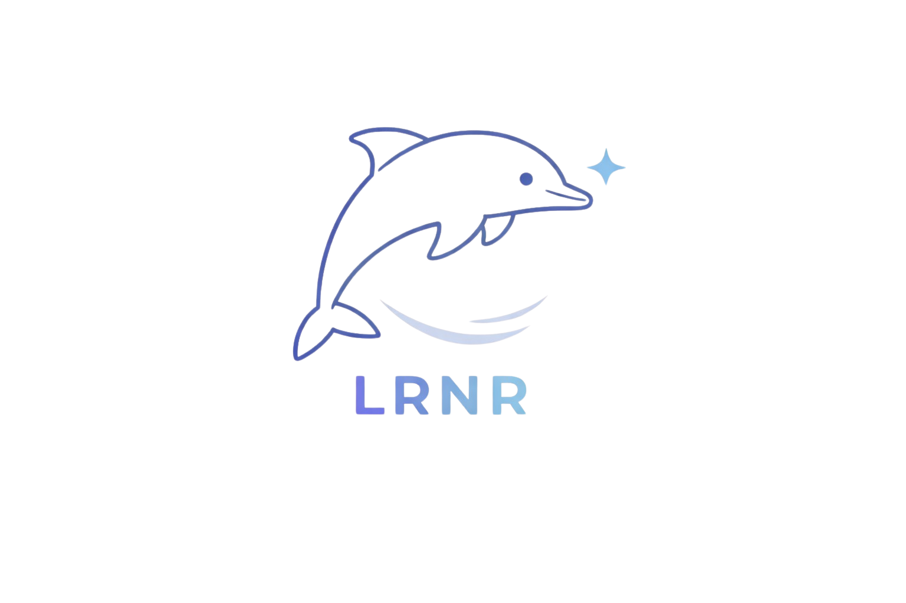
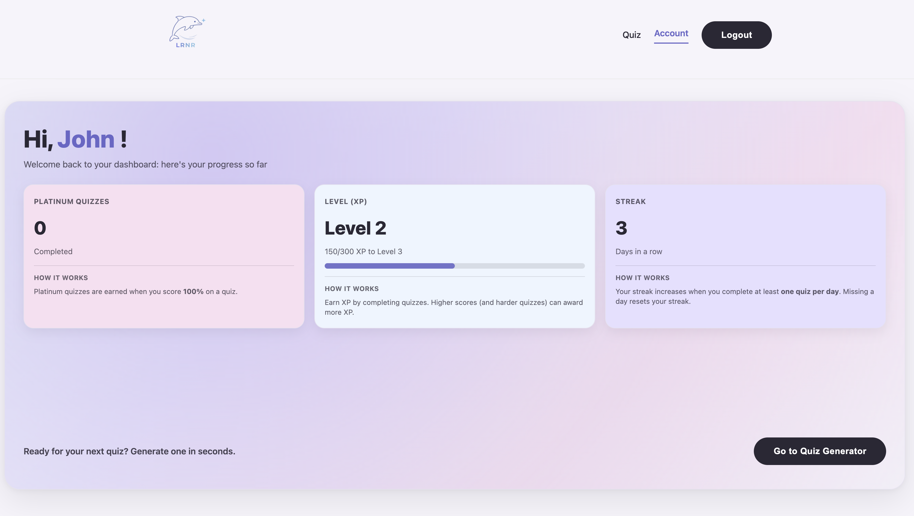

# LRNR AI Quiz Platform

LRNR is an AI-powered quiz generation platform designed to help users test their knowledge, track their learning progress, and build consistent study habits.

The application allows users to generate quizzes, complete them, and monitor their learning performance through a personalized dashboard.

# Project Overview

This project was developed as part of a full stack web development apprenticeship and serves as a portfolio project demonstrating modern frontend and backend development practices.

The application allows users to:

• Generate AI-powered quizzes  
• Track their progress and learning streaks  
• Earn XP based on quiz performance  
• Level up through a gamified learning system  
• View quiz results and analytics  

The platform combines an interactive user interface with a SQL-based backend to manage user data, quiz performance, and progress tracking.

# Dashboard Example

The dashboard provides users with a clear overview of their learning progress including:

• **Streak Tracking** – number of consecutive days completing quizzes  
• **Platinum Quizzes** – quizzes where the user scored 100%  
• **XP and Level Progression** – users earn XP based on quiz performance and level up over time  

# Features

### AI Quiz Generation
Users can generate quizzes dynamically based on topics and difficulty levels.

### Quiz Results
After completing a quiz, users can view:

• Total correct answers  
• Score percentage  
• XP earned based on performance  

### Progress Tracking
The platform gamifies learning by tracking:

• XP earned  
• Current level  
• Daily streaks  
• Platinum quizzes

### Authentication
Users must log in to access protected features such as quiz generation and the dashboard.

### Responsive Design
The site is responsive and adapts across:

• Desktop  
• Tablet  
• Mobile devices  

Media queries ensure usability on screens smaller and larger than **800px**.

# Tech Stack

### Frontend
- React
- React Router
- CSS
- Responsive Media Queries

### Backend
- Node.js
- Express

### Database
- MySQL
- SQL queries for storing user progress, quiz results, and authentication data

# Accessibility

The project follows **WCAG 2.0 AA accessibility guidelines**, ensuring the site is usable for a wide range of users.

Key considerations include:

• Semantic HTML structure  
• Accessible navigation  
• Responsive layouts  
• Clear visual hierarchy

# Pages Included

The application includes the following main pages:

### Home Page
Landing page introducing the platform.

### Account Dashboard
Displays user progress including XP, level, streaks, and platinum quizzes.

### Quiz Generation Page
Allows users to generate quizzes dynamically.

### Quiz Page
Displays generated questions and collects user answers.

### Results Page
Shows quiz performance including score, percentage, and XP earned.

### 404 Page
Displays when users attempt to navigate to a non-existent route.

# Installation

Clone the repository:
1. git clone https://github.com/spretell/LRNR.git
2. cd LRNR
Install Dependencies : 
3. cd client 
4. npm install 
Install server dependencies 
5. cd server
6. npm install
Create a .env file inside the server folder and add the required environmental variables 
7. Your .env : 
PORT=3000
JWT_SECRET=your_secret_key
DB_HOST=localhost
DB_USER=your_database_user
DB_PASSWORD=your_database_password
DB_NAME=your_database_name 

Run the Application
8. cd server 
9. npm run dev 
Start the frontend
10. cd client 
11. npm run dev

# Authors 
Brittany Ramirez, Elhadji Massow Ndiaye, Renee Messersmith, Stephanie Pretell
